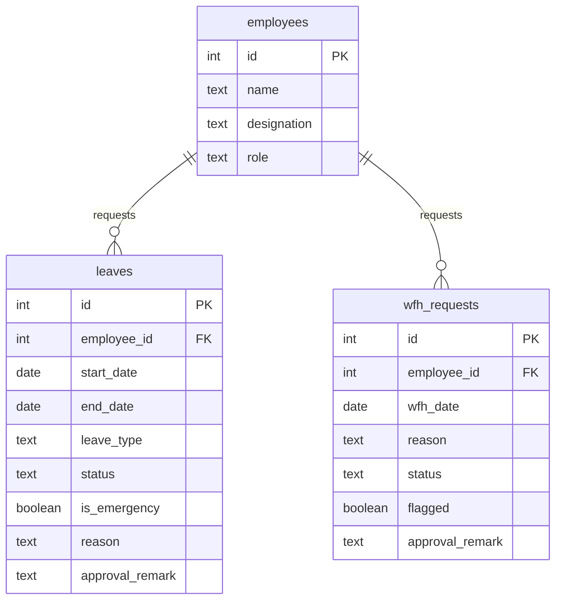
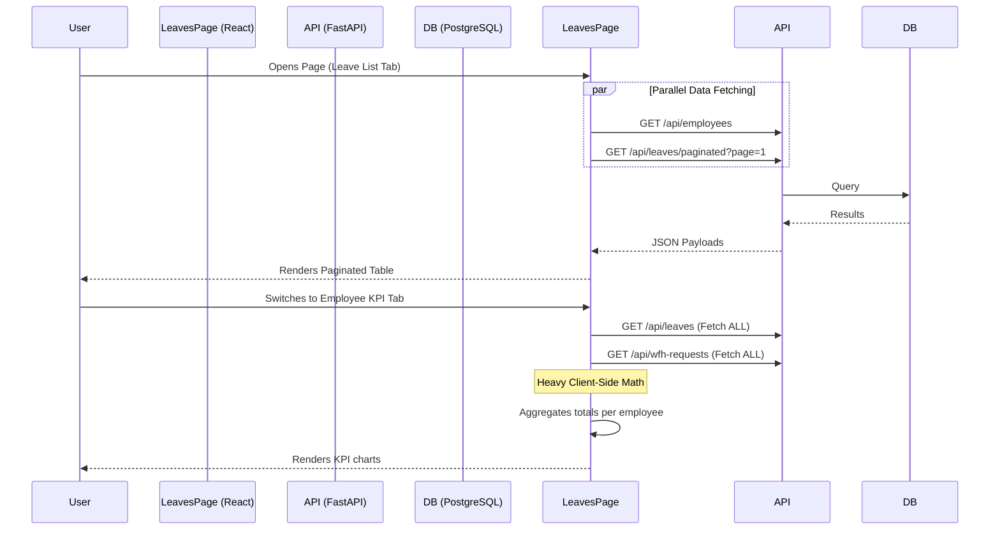

# Admin Leave Page — Technical Documentation

## Table of Contents
1. [Overview](#1-overview)
2. [Database Schema](#2-database-schema)
3. [APIs Used by the Admin Leave Page](#3-apis-used-by-the-admin-leave-page)
4. [Network Performance Analysis](#4-network-performance-analysis)
5. [Current Data Flow](#5-current-data-flow)
6. [Current Triggers / Automatic Flows](#6-current-triggers--automatic-flows)
7. [Problems / Issues](#7-problems--issues)
8. [Solutions / Recommendations](#8-solutions--recommendations)
9. [Proposed Optimized Architecture / Flow](#9-proposed-optimized-architecture--flow)
10. [Before vs After Performance](#10-before-vs-after-performance)
11. [Implementation Plan](#11-implementation-plan)
12. [Validation / Testing Checklist](#12-validation--testing-checklist)
13. [Assumptions / Open Questions](#13-assumptions--open-questions)

---

## 1. Overview
The **Admin Leave Page** (implemented in `LeavesPage.jsx`) is a centralized dashboard for Admins, HR, PMs, and Team Leads to manage employee absences. 

### What it Displays
- **Calendar Tab:** A unified visual calendar showing approved and pending leaves and WFH requests.
- **Leave List Tab:** A paginated table of all leave requests (Sick, Casual, Comp-Off, LWP) with approval/rejection workflows.
- **WFH Requests Tab:** A paginated table of Work From Home requests.
- **Employee KPI Tab:** A statistical view aggregating leave and WFH data to show trends, remaining balances, and adherence to limits.

### Data Processing & Retrieval
The page uses a hybrid fetching approach. The List tabs use server-side pagination (`/api/leaves/paginated` and `/api/wfh-requests/paginated`). However, the "Employee KPI" and Calendar tabs trigger full-table fetches (`/api/leaves` and `/api/wfh-requests` without pagination), causing massive payload transfers and rendering bottlenecks on the client.

---

## 2. Database Schema

The Admin Leave Page relies heavily on three primary tables.

### Schema Normalization & Architectural Concerns
- **Duplication of Status Logic:** Both `leaves` and `wfh_requests` track `status`, `reason`, and `approval_remark`. 
- **Calendar Merging:** The UI has to fetch both tables and manually merge them on the frontend to populate the Calendar.

---

## 3. APIs Used by the Admin Leave Page

| API Name | URL / Endpoint | Current Response Time | Current Payload Size | Response Time After Optimization | Payload Size After Optimization | Purpose / Usage |
|----------|---------------|-----------------------|----------------------|---------------------------------|---------------------------------|----------------|
| **Leaves (Paginated)** | `GET /api/leaves/paginated` | *(TBD)* | *(TBD)* | | | **Purpose:** Populates the Leave List table.   **Unnecessary:** None, relies on server pagination.   **Impact:** Very fast. |
| **WFH (Paginated)** | `GET /api/wfh-requests/paginated` | *(TBD)* | *(TBD)* | | | **Purpose:** Populates the WFH Requests table.   **Impact:** Very fast. |
| **All Leaves** | `GET /api/leaves` | *(TBD)* | *(TBD)* | | | **Purpose:** Fetched when switching to Employee KPI or Calendar tab.   **Unnecessary:** Entire company's historical leaves.   **Impact:** Massive payload size; client-side CPU spike when aggregating KPIs. |
| **All WFH** | `GET /api/wfh-requests` | *(TBD)* | *(TBD)* | | | **Purpose:** Fetched for Employee KPI or Calendar.   **Impact:** High memory overhead. |
| **Employees** | `GET /api/employees` | *(TBD)* | *(TBD)* | | | **Purpose:** Required to display names/avatars across all tabs.   **Unnecessary:** 20+ fields (avatar URLs, Slack IDs, working hours).   **Impact:** Large payload size, mostly unused. |

---

## 4. Network Performance Analysis

1. **The Biggest Bottleneck (KPI/Calendar):** When a user switches to the "Employee KPI" tab, the UI triggers `GET /api/leaves` and `GET /api/wfh-requests` (the unpaginated, full-table endpoints). For a company with history, this causes a massive data download, leading to network blocking and browser stuttering.
2. **Employee Directory Overhead:** `GET /api/employees` fetches the entire employee directory with all 20+ fields just so the UI can map `employee_id` to `employee_name` in the tables. 
3. **Over-Fetching in KPI:** The client downloads years of historical leave data just to calculate a simple numerical summary (e.g., "Sick Leaves Taken: 5").

---

## 5. Current Data Flow

---

## 6. Current Triggers / Automatic Flows

- **Approval / Rejection Mutations:** When an Admin approves a leave (`PUT /api/leaves/{id}/approve`), React Query invalidates both `leaves-page` and `leaves`. This triggers a massive background refetch of all data, even if the user is just looking at the paginated table.
- **Undo Actions:** The same invalidation logic applies to `undoApprove` and `undoReject`.
- **Zustand State Hydration:** Tab states and filters are persisted to `localStorage` via Zustand, ensuring the user returns to their exact spot.

---

## 7. Problems / Issues

| Problem | Category | Root Cause | Impact | Priority | Affected Component |
|---------|----------|------------|--------|----------|-------------------|
| **KPI Tab fetches full DB** | Architecture / API | No backend aggregation endpoint exists for KPIs. | Freezes UI, high memory/bandwidth transfer. | P0 | Employee KPI Tab, `GET /api/leaves` |
| **Calendar fetches full DB** | Architecture / API | Calendar needs events but fetches full history instead of a date range. | High load time for Calendar. | P0 | Calendar Tab |
| **Aggressive Query Invalidation** | Frontend | Approving a single leave refetches the entire historical `leaves` cache. | Wasted API calls on every action. | P1 | `approveMutation`, `rejectMutation` |
| **Employee payload bloat** | API | Fetching full employee objects just for ID-to-Name mapping. | Slow initial load. | P2 | `GET /api/employees` |

---

## 8. Solutions / Recommendations

### P0: Backend KPI & Calendar Endpoints
- **Proposed Solution:** Create `/api/analytics/leaves/kpi` and `/api/leaves/calendar?start=X&end=Y`. 
- **Why it solves the problem:** Moves math to Postgres. The KPI endpoint returns `{ employee_id, total_sick, total_casual }` directly. The Calendar endpoint only returns data for the visible month.
- **Frontend Changes:** Swap `useQuery` calls in `EmployeeKPIPanel` and `LeaveCalendar`.

### P1: Optimistic UI Updates
- **Proposed Solution:** Instead of invalidating queries globally on approval, update the React Query cache optimistically, or at least only invalidate the paginated query.

### P2: Slim Employee Directory
- **Proposed Solution:** Use a projection in `/api/employees` (or create a slim `?compact=true` flag) that returns only `id, name, designation, status`.

---

## 9. Proposed Optimized Architecture / Flow

1. **Leave List / WFH Requests:** Continue using the existing fast `/paginated` endpoints.
2. **Calendar:** Fetch `/api/leaves/calendar?start=...&end=...` to only get the currently viewed month.
3. **Employee KPI:** Fetch `/api/analytics/leaves/kpi-summary`. No raw rows are returned—only aggregated metrics calculated via SQL `GROUP BY`.

---

## 10. Before vs After Performance

| API / Area | Current Payload | Current Time | Target Payload | Target Time | Expected Improvement |
|------------|-----------------|--------------|----------------|-------------|----------------------|
| **KPI Data (`/leaves`)** | *(TBD)* | *(TBD)* | < 5 KB | < 300 ms | Prevents full DB download |
| **Calendar (`/leaves`)** | *(TBD)* | *(TBD)* | < 5 KB | < 200 ms | Only fetches visible month |
| **Employees** | *(TBD)* | *(TBD)* | < 15 KB | < 300 ms | Removes avatar/slack fields |

*(Note: Target values are estimations to be filled with exact measurements post-implementation.)*

---

## 11. Implementation Plan

1. **Backend API Creation:**
   - Create SQL-based aggregation endpoint for KPIs.
   - Create date-scoped endpoint for Calendar.
2. **Frontend Integration:**
   - Update `EmployeeKPIPanel` to consume the pre-aggregated endpoint.
   - Update `LeaveCalendar` to pass `monthStart` and `monthEnd` parameters.
3. **Query Invalidation Fixes:**
   - Adjust `approveMutation` to avoid invalidating the `["leaves"]` full cache.
4. **Testing & QA:** Run through Validation Checklist.
5. **Measurement:** Record "After Optimization" network metrics.

---

## 12. Validation / Testing Checklist

- [ ] **Role Visibility:** Ensure PMs only see their team members' leaves; Admins see everyone.
- [ ] **Calendar Rendering:** Verify the calendar still accurately colors approved/pending/rejected events for the visible month.
- [ ] **KPI Accuracy:** Ensure the backend SQL aggregation matches the exact math previously done on the frontend.
- [ ] **Pagination Stability:** Ensure approving an item on Page 2 doesn't reset the user to Page 1 unnecessarily.
- [ ] **Performance:** Verify the network tab no longer downloads unpaginated `leaves` or `wfh_requests`.

---

## 13. Assumptions / Open Questions
- **KPI Calculation Logic:** Need to carefully inspect `EmployeeKPIPanel.jsx` to see exactly what formulas it uses (e.g., prorated leave calculations) to replicate them correctly in SQL.
- **Calendar Component:** Need to check if `LeaveCalendar` natively supports fetching data by month, or if it expects all events upfront.
