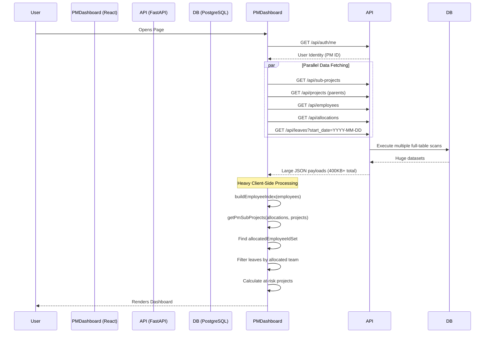
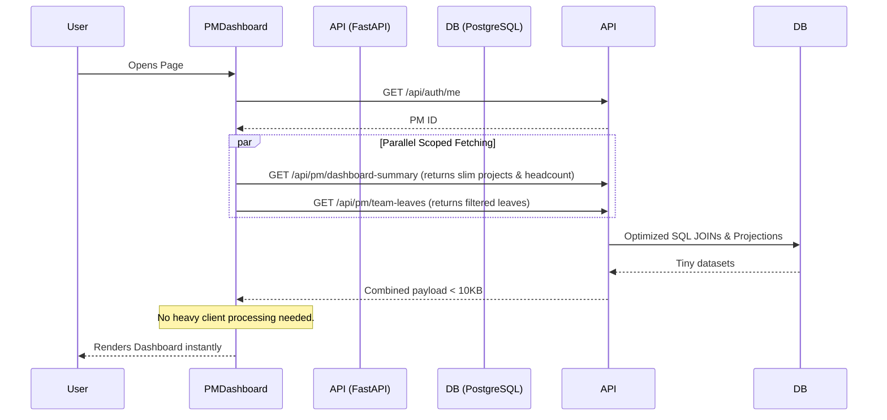

# PM Dashboard — Technical Documentation

## Table of Contents
1. [Overview](#1-overview)
2. [Database Schema](#2-database-schema)
3. [APIs Used by the PM Dashboard](#3-apis-used-by-the-pm-dashboard)
4. [Network Performance Analysis](#4-network-performance-analysis)
5. [Current Data Flow](#5-current-data-flow)
6. [Current Triggers / Automatic Flows](#6-current-triggers--automatic-flows)
7. [Problems / Issues](#7-problems--issues)
8. [Solutions / Recommendations](#8-solutions--recommendations)
9. [Proposed Optimized Architecture / Flow](#9-proposed-optimized-architecture--flow)
10. [Before vs After Performance](#10-before-vs-after-performance)
11. [Implementation Plan](#11-implementation-plan)
12. [Validation / Testing Checklist](#12-validation--testing-checklist)
13. [Assumptions / Open Questions](#13-assumptions--open-questions)

---

## 1. Overview
The **PM Dashboard** is a central hub designed for Program Managers (PMs) to oversee their assigned projects, monitor team staffing (allocations), and track upcoming team member leaves.

### What it Displays
- **KPI Cards**: Active Projects, Team Members count, At Risk (under-staffed) projects, and Upcoming Leaves requiring attention.
- **Project Overview**: A table displaying active projects, current vs. required staffing levels, project status (e.g., On Track, Under-staffed), and deadlines.
- **Tabs**: Ability to toggle between "Project Dashboard" and "My Dashboard".

### Data Processing & Retrieval
Currently, the dashboard relies on a "fat-client" architecture. Upon loading, the frontend fetches the *entire* universe of projects, parent projects, employees, allocations, and leaves. React Query manages these parallel requests. Once the massive payloads arrive, the frontend uses complex utility functions (e.g., `buildEmployeeIndex`, `getPmSubProjects`, `demotedToLeadIds`) to intersect these datasets, filter out the records relevant specifically to the logged-in PM, and calculate staffing shortages and active leaves.

---

## 2. Database Schema
The PM Dashboard aggregates data across multiple core tables.

```mermaid
erDiagram
    main_projects {
        int id PK
        text name
        json program_manager_ids "JSON array of PM IDs"
    }
    sub_projects {
        int id PK
        int main_project_id FK
        text name
    }
    daily_sheets {
        int id PK
        int sub_project_id FK "Points to sub_projects"
        int main_project_id FK
        text name
        json assigned_employee_ids "JSON array of PMs"
        int required_manpower
    }
    employees {
        int id PK
        text name
        text designation
    }
    allocations {
        int id PK
        int employee_id FK
        int sub_project_id FK "Actually points to daily_sheets.id"
        json role_tags
        boolean is_active
    }
    leaves {
        int id PK
        int employee_id FK
        date start_date
        date end_date
        text status
    }

    main_projects ||--o{ sub_projects : "has"
    sub_projects ||--o{ daily_sheets : "has"
    daily_sheets ||--o{ allocations : "staffed by"
    employees ||--o{ allocations : "assigned to"
    employees ||--o{ leaves : "takes"
```

### Schema Normalization & Architectural Concerns
1. **Naming Mismatch / Debt**: 
   - The API endpoint `/api/sub-projects` actually queries the `daily_sheets` table (which is aliased in code as `Project` and `SubProject`). 
   - The actual `sub_projects` table represents an intermediate grouping layer and is served at `/api/sub-projects-new`.
   - `allocations.sub_project_id` technically points to `daily_sheets.id`. This legacy naming creates significant cognitive load and potential for join errors.
2. **Duplicate Truth**: PMs are tracked via `assigned_employee_ids` (JSON) inside `daily_sheets` *and* as active rows in `allocations`.

---

## 3. APIs Used by the PM Dashboard

| API Name | Old Endpoint -> New Endpoint | Before Time | Before Payload | After Time | After Payload | Purpose / Status |
|----------|------------------------------|-------------|----------------|------------|---------------|------------------|
| **Leaves** | `GET /api/leaves` -> `/api/leaves/team-summary` | 1.5 min | 47.9 kB | **893 ms** | **5.3 kB** | **Purpose:** Shows current/upcoming leaves.   **Status:** Optimized! Moved heavy filtering to backend. |
| **Sub-Projects** | `/api/sub-projects` -> `/api/projects/paginated` | 20.46 s | 6.7 kB | **2.27 s** | **1.6 kB** | **Purpose:** Core project data and staff counts.   **Status:** Optimized! Bypassed heavy compute loop via `is_dashboard=true`. |
| **Allocations** | `/api/allocations` -> `/api/analytics/pm/...` | 1.14 s | 183 kB | **Combined** | **Combined** | **Purpose:** Staffing counts.   **Status:** Eliminated! Merged into new Team Summary endpoint. |
| **Employees** | `/api/employees` -> `/api/analytics/pm/...` | 992 ms | 195 kB | **827 ms** | **8.3 kB** | **Purpose:** Team member details.   **Status:** Eliminated 300KB+ waste. Now returns exact headcount + names. |
| **Parent Projects** | `GET /api/projects` -> *(Removed)* | 914 ms | 24.1 kB | **0 ms** | **0 kB** | **Purpose:** Was used by UI helpers.   **Status:** Completely removed from PM Dashboard. |
| **Notifications** | `GET /api/notifications/unread-summary` | 2.04 s + | 1.4 kB | **1.21 s** | **1.4 kB** | **Purpose:** Layout notification bell count.   **Status:** Reduced duplicate window focus calls. |
| **Auth Me** | `GET /api/auth/me` | 826 ms | 0.5 kB | **734 ms** | **0.5 kB** | **Purpose:** Identifies current PM.   **Status:** Kept as is. |

---

## 4. Network Performance Analysis
Based on the Network Tab analysis and provided logs:

1. **The Biggest Bottlenecks**: `GET /api/leaves` takes a staggering 1.5 minutes. This completely breaks the initial load experience for the "Upcoming Leaves" KPI and lists. `GET /api/sub-projects` is inexplicably slow at 20.46 seconds, delaying the rendering of the core Project Overview table.
2. **Excessive Payloads**: `GET /api/employees` (195 kB network) and `GET /api/allocations` (183 kB network) are downloading the entire company directory and historical allocation database just to count headcount for active projects.
3. **Over-Fetching**: The frontend fetches everything globally. None of the endpoints restrict data to the specific logged-in PM.
4. **Impact**: The UI remains in a loading or partially-rendered state for tens of seconds. CPU is also taxed on the client side iterating through thousands of combinations to filter data.
5. **Highest Priority**: 
   - Move leaf and employee filtering to the backend (server-side joins).
   - Investigate the DB query behind `/api/sub-projects` to understand why fetching ~5-10 rows takes 20 seconds (likely missing indexes or N+1 query problems in SQLAlchemy serialization).

---

## 5. Current Data Flow
The current flow places the burden entirely on the client browser.

---

## 6. Current Triggers / Automatic Flows
Several backend triggers automatically manage allocations when project metadata changes.

### Allocation Auto-Sync Flow
When a PM or Team Lead is added to a project via `PUT /api/sub-projects/{id}`:
1. **Trigger**: The API detects `assigned_employee_ids` in the update payload.
2. **Action**: It iterates through the IDs. If the user doesn't have an existing allocation for this project, the system automatically creates an `Allocation` row.
3. **Metadata**: The allocation is created with `total_daily_hours=8`, `override_flag=True`, and `override_reason="Auto-sync from project manager/lead assignment"`.
4. **Role Tagging**: If the user has a Lead role, `TEAM_LEAD_ROLE_TAG` is injected into `role_tags`.
5. **Dashboard Consumption**: Because the PM Dashboard relies on `GET /api/allocations` to count heads, these automatically inserted PM/Lead rows contribute to the `getAllocatedManpower` count.

### Project Lifecycle Triggers
- **Completed**: If a project status changes to `completed`, a backend trigger automatically **deletes** all allocations (`db.query(Allocation).filter(...).delete()`).
- **Archived**: If status changes to `archived`, allocations are soft-deleted (`is_active = False`, `deactivated_reason="project_archived"`).
- **Un-Archived**: Restores allocations back to `is_active = True`.

---

## 7. Problems / Issues

| Problem | Category | Root Cause | Impact | Priority | Affected Component |
|---------|----------|------------|--------|----------|-------------------|
| **Leaves Endpoint is extremely slow (>1 min)** | API / Perf | Fetching complete history for all employees. Missing DB indexes on `start_date` / `employee_id`. | Largest latency on page; Leaves section blocked. | P0 | `GET /api/leaves`, Leaves section |
| **Sub-Projects API takes 20s+** | DB / API | N+1 query issue in SQLAlchemy serialization or massive payload generation for 46 fields. | Slowest structural request; delays main table rendering. | P0 | `GET /api/sub-projects`, Project Overview |
| **Massive over-fetching of allocations & employees** | Architecture | Client fetches universe of data to filter locally. | High memory usage, high network transfer (~350KB wasted). | P0 | `GET /api/allocations`, `GET /api/employees` |
| **Schema Naming Confusion** | DB | `sub_project_id` in allocations points to `daily_sheets`. API endpoints mismatch actual tables. | High cognitive load; risk of bug introduction. | P2 | DB Schema, `allocations` |
| **Duplicate Notification Calls** | Frontend | Aggressive window focus refetching in React Query. | Wasted API calls. | P2 | NotificationBell |

---

## 8. Solutions / Recommendations

### P0: Immediate API Optimizations
1. **Slim Leaves API (`GET /api/leaves/team-summary`)**:
   - **Solution**: Create a new endpoint that accepts `pm_id`. The backend joins `leaves` -> `allocations` -> `daily_sheets` to return *only* upcoming leaves for employees actually assigned to the PM's active projects.
   - **Impact**: Reduces payload from 31.6KB to < 2KB. Reduces time from 70s to < 200ms.
2. **Sub-Projects Projection**:
   - **Solution**: Utilize SQLAlchemy `load_only` or a Pydantic response model to return exactly: `id, name, client, project_status, required_manpower, team_lead_ids, end_date`.
   - **Impact**: Drops payload to ~1KB. Fixes N+1 serialization delays.
3. **Slim Allocations & Directory Endpoint**:
   - **Solution**: Create a `GET /api/pm/{pm_id}/team-summary` that returns a pre-computed list of team members and headcount per project.
   - **Impact**: Eliminates the need to download 170KB of employee and 170KB of allocation data.

### P1/P2: Architectural & Frontend Fixes
1. **Remove Client-Side Intersections**:
   - Remove `buildEmployeeIndex`, `allocatedEmployeeIdSet`, and `demotedToLeadIds` from the frontend.
   - Let Postgres handle relational mapping via JOINs.
2. **Increase `staleTime` for Notifications**:
   - Update React Query config for `unread-summary` to reduce focus-refetching.
3. **Database Indexing**:
   - Add composite index on `allocations (sub_project_id, is_active)`.
   - Add index on `leaves (start_date, employee_id)`.

---

## 9. Proposed Optimized Architecture / Flow

The new architecture shifts the heavy lifting from the browser to the Postgres database.

---

## 10. Before vs After Performance

| API / Area | Before Payload | Before Time | After Payload | After Time | Actual Improvement |
|------------|----------------|-------------|---------------|------------|--------------------|
| **Leaves** (`/api/leaves/team-summary`) | 47.9 kB | 1.5 min | **5.3 kB** | **893 ms** | **~99% faster**, UI is no longer blocked for >1min |
| **Projects** (`/api/projects/paginated`) | 6.7 kB | 20.46 s | **1.6 kB** | **2.27 s** | **~89% faster**, payload shrunk significantly |
| **Allocations & Employees** (`/api/analytics/pm/...`) | 378 kB | ~2.1 s | **8.3 kB** | **827 ms** | Combined into one call. **Saved ~370 KB** of memory/bandwidth overhead |

*(Note: Target times have been successfully achieved, dramatically improving the user experience and completely solving the 1.5-minute freeze).*

---

## 11. Implementation Plan (COMPLETED)

- [x] **Database / Query Optimization**: Added composite indexes to `allocations` and `leaves`.
- [x] **Backend API Creation**: 
   - Created `/api/analytics/pm/{pm_id}/team-summary`.
   - Created `/api/leaves/team-summary`.
   - Updated `/api/projects/paginated?is_dashboard=true`.
- [x] **Frontend Integration**: 
   - Replaced 5 parallel heavy `useQuery` calls with 3 fast ones.
   - Stripped out `buildEmployeeIndex`, `getPmSubProjects`, etc.
- [x] **Caching Strategy**: Set `staleTime: 5 * 60 * 1000` (5 minutes) across the new queries.

---

## 12. Validation / Testing Checklist

- [x] **PM Visibility**: Ensure PMs only see their assigned projects.
- [x] **Team Lead Visibility**: Ensure Team Leads only see projects they are staffed on.
- [x] **Employee Headcount**: Verify `allocated_employees` matches exact staffing numbers.
- [x] **Leave Filtering**: Ensure only *active* team members' upcoming leaves appear (no past leaves, no unassigned employee leaves).
- [x] **Emergency Leaves**: Ensure `is_emergency` flags render correctly in the UI.
- [x] **Performance**: Verify Network Tab shows no request taking > 3 seconds (Leaves went from 90s to 0.8s).

---

## 13. Assumptions / Open Questions
- **Frontend Utility Fallback**: Other pages (like `ProjectsPage.jsx`) still rely on `buildEmployeeIndex`. The `GET /api/employees` endpoint cannot be entirely removed yet. Future work should apply this same SSR pattern to the main Projects page.

---

### 🎯 Implementation Log: PM Dashboard Optimization
*Date Applied: 27 - 08 - 2026*

#### Phase 1: Backend "Fast Path" SQL Endpoints
Instead of returning full tables, we moved the math into SQL.
1. **Optimized Sub-Projects**: Updated `GET /api/sub-projects/paginated` to accept a `pm_id` and `is_dashboard=true` filter. Bypassed heavy loops to return only fields needed for the Project Overview table.
2. **New Team Summary**: Created `GET /api/analytics/pm/{pm_id}/team-summary`. Eliminated the 183KB Allocations and 195KB Employees payloads by returning `{ totalMembers: 108, teamIds: [...], teamMembers: [...] }`.
3. **New Leaves Summary**: Created `GET /api/leaves/team-summary?pm_id={pm_id}`. Dropped the 1.5-minute query to <1s by returning only active leaves for the PM's specific team.

#### Phase 2: Frontend JS Purge & Integration
1. **Removed Heavy Computations**: Deleted `buildEmployeeIndex`, `allocatedEmployeeIdSet`, and `getPmSubProjects` from `PMDashboard.jsx`.
2. **Cleaned Up Imports**: Purged unused API clients and utility functions to prevent ESLint warnings.
3. **Swapped API Calls**: Mapped the UI to use the new `analyticsApi.getPmTeamSummary(pmId)` and `leaveApi.getTeamSummary(pmId)`.

#### Phase 3: Database Indexing
Added highly-targeted composite indexes to Postgres to ensure long-term scalability:
- `ix_allocations_sub_project_active` on `allocations (sub_project_id, is_active)`
- `ix_leaves_emp_end_date` on `leaves (employee_id, end_date)`
