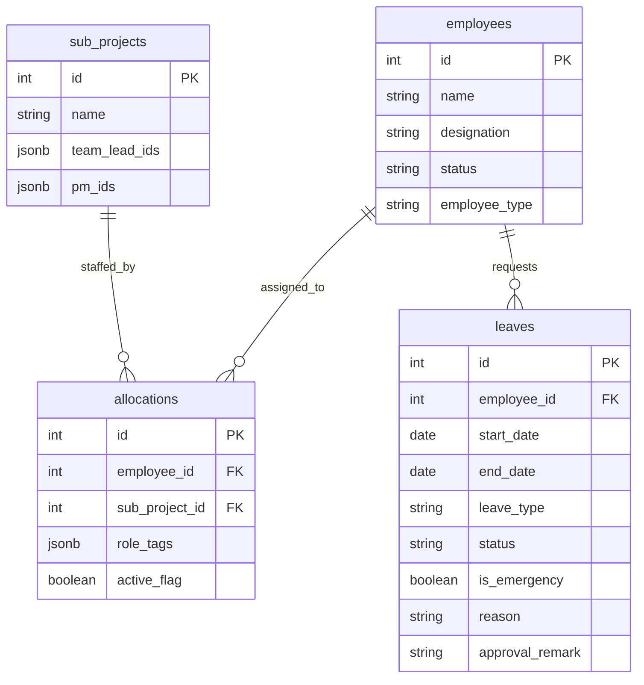
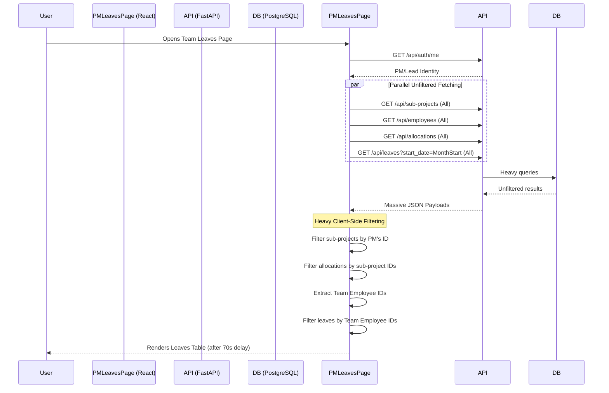
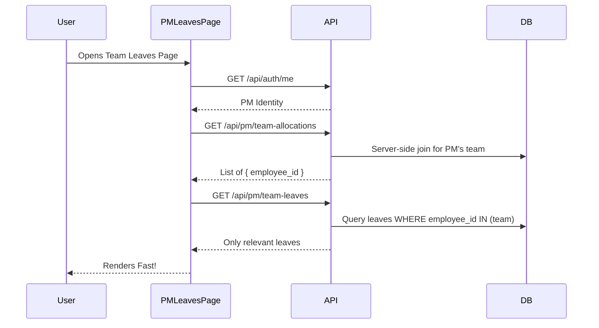

# PM Team Leaves Page — Technical Documentation

## Table of Contents
1. [Overview](#1-overview)
2. [Database Schema](#2-database-schema)
3. [APIs Used by the PM Team Leaves Page](#3-apis-used-by-the-pm-team-leaves-page)
4. [Network Performance Analysis](#4-network-performance-analysis)
5. [Current Data Flow](#5-current-data-flow)
6. [Current Triggers / Automatic Flows](#6-current-triggers--automatic-flows)
7. [Problems / Issues](#7-problems--issues)
8. [Solutions / Recommendations](#8-solutions--recommendations)
9. [Proposed Optimized Architecture / Flow](#9-proposed-optimized-architecture--flow)
10. [Before vs After Performance](#10-before-vs-after-performance)
11. [Implementation Plan](#11-implementation-plan)
12. [Validation / Testing Checklist](#12-validation--testing-checklist)
13. [Assumptions / Open Questions](#13-assumptions--open-questions)

---

## 1. Overview
The **PM Team Leaves Page** is a dedicated interface designed for Project Managers (PMs) and Team Leads to monitor, review, and manage the leave requests of their allocated team members.

### What it Displays and Who Uses It
- **Users:** Project Managers (PMs) and Team Leads.
- **Displays:**
  - A consolidated list or calendar view of current, upcoming, and past leaves for their specific team members.
  - Leave status (Pending, Approved, Rejected).
  - Emergency vs. Planned leaves.

### Major Sections/Components
- **Team Leaves List/Table:** Displays the leave records (start date, end date, leave type, status).
- **Filter & Search:** Options to filter leaves by specific team members, date ranges, or leave status.

### Data Processing & Retrieval
The page identifies the logged-in PM/Lead, resolves their assigned sub-projects and team allocations, and then fetches leave data. Currently, it retrieves massive unfiltered datasets (all company leaves, all allocations, all employees) and performs heavy client-side filtering to display only the relevant team members' leaves. This approach causes severe performance bottlenecks.

---

## 2. Database Schema

The PM Team Leaves Page relies on relationships between employees, their sub-project allocations, and their leave requests.

### Schema Normalization & Architectural Concerns
- **Denormalized Roles in Sub-projects:** Storing `team_lead_ids` and `pm_ids` as JSONB arrays inside `sub_projects` makes it slower to query which projects belong to a specific PM/Lead.
- **Client-Side Joins:** The database schema is fully relational, but the backend APIs force the frontend to download full tables and perform relational joins (e.g., matching leaves to allocated team members) in the browser.

---

## 3. APIs Used by the PM Team Leaves Page

| API Name | URL / Endpoint | Current Response Time | Current Payload Size | Response Time After Optimization | Payload Size After Optimization | Purpose / Usage |
|----------|---------------|-----------------------|----------------------|---------------------------------|---------------------------------|----------------|
| **Leaves (All)** | `GET /api/leaves` | **~1.7 min** (102s) | 80.6 KB | | | **Purpose:** Fetches unpaginated leaves.   **Impact:** Catastrophic latency; completely freezes page. |
| **Leaves (Paginated)** | `GET /api/leaves/page?page=1...` | **~1.7 min** (102s) | 5.0 KB | | | **Purpose:** Fetches paginated leaves for the table.   **Impact:** Still takes 1.7 minutes, indicating severe database locks or missing indexes. |
| **Calendar** | `GET /api/leaves/calendar?month=YYYY-MM` | **~1.5 min** (90s) | 47.3 KB | | | **Purpose:** Populates the calendar view.   **Impact:** Huge bottleneck. |
| **WFH Requests** | `GET /api/wfh-requests` | **~58.7 s** | 52.3 KB | | | **Purpose:** Fetches WFH data.   **Impact:** Slow query dragging down performance. |
| **Employees (All)** | `GET /api/employees` | ~974 ms | 195 KB | | | **Purpose:** Fetches company directory.   **Impact:** Over-fetching 195KB when only a handful of team names are needed. |
| **Employees (Team)** | `GET /api/employees?team_only=true` | ~947 ms | 195 KB | | | **Purpose:** Intended to fetch only the PM's team.   **Impact:** Filter appears broken as it returns the exact same 195KB payload as the unfiltered endpoint. |
| **Auth Identity** | `GET /api/auth/me` | ~769 ms | 0.5 KB | | | **Purpose:** Fetches current user identity. |

---

## 4. Network Performance Analysis

Based on the actual network tab inspection:
- **Catastrophic Database Delays:** The `leaves` and `page?page=1...` requests both take a staggering **1.7 minutes** to return. The `calendar` endpoint takes **1.5 minutes**, and `wfh` takes **~59 seconds**. This clearly indicates that the underlying database queries in `leaves.py` are severely unoptimized, lack indexing, or are experiencing lock contention.
- **Broken Filtering:** The `employees?team_only=true` endpoint takes ~947ms and returns **195 KB**, which is exactly identical to the unfiltered `employees` request (195 KB). This implies the `team_only` backend filter is either not working or returning full object graphs for every employee instead of a slim subset.
- **Result:** The page takes roughly **1.8 minutes to load**, downloading over 570 KB of JSON, rendering it practically unusable.

---

## 5. Current Data Flow

The current data flow fetches all data and filters it in the browser:

---

## 6. Current Triggers / Automatic Flows

- **Team Roster Updates:** When an employee is allocated or de-allocated from a PM's sub-project, their leaves automatically start/stop appearing on this page. This is because the page dynamically rebuilds the team roster on every load by cross-referencing `allocations`.
- **Query Invalidation:** Any leave approval/rejection (if PMs have permission) or background sync might invalidate the `leaves` cache, triggering the entire 70-second refetch.

---

## 7. Problems / Issues

| Problem | Category | Root Cause | Impact | Severity | Affected Component |
|---------|----------|------------|--------|----------|-------------------|
| **Leaves endpoint blocks UI** | API / Performance | `GET /api/leaves` takes ~70s due to missing DB indexes or bad backend joins. | Completely breaks page usability. | P0 | Leaves Table |
| **Sub-projects N+1 queries** | API / Performance | `GET /api/sub-projects` takes ~22s for tiny payload. | Delays the dependency chain for resolving team members. | P0 | Page Initialization |
| **Client-side relational joins** | Architecture | API forces frontend to download full tables and map them manually. | High CPU usage, massive bandwidth waste, poor scaling. | P0 | Entire Page Logic |
| **Over-fetching Employees & Allocations** | Data Flow | Fetching all 250+ employees and 300+ allocations for ID mapping. | High memory footprint. | P1 | Data processing hooks |

---

## 8. Solutions / Recommendations

### P0: Backend Team Leaves Endpoint (Immediate Fix)
- **Proposed Solution:** Create `GET /api/leaves/team-summary?employee_ids=...` or `/api/pm/team-leaves`.
- **Why it solves the problem:** Pushes the heavy filtering to Postgres. Only returns the leaves of the PM's actual team members.
- **Changes required:** Backend API addition; update frontend React Query to use this endpoint.

### P0: Fix Sub-projects Delay
- **Proposed Solution:** Create a PM-specific summary endpoint (`/api/pm/sub-projects-summary`) that only queries projects where `pm_ids` contains the user's ID. Ensure proper DB indexing.
- **Why it solves the problem:** Bypasses whatever is causing the 22-second lockup and reduces payload size.

### P1: Slim Directory endpoints
- **Proposed Solution:** Use `GET /api/employees/slim` (id, name only) and `GET /api/pm/team-allocations`.

---

## 9. Proposed Optimized Architecture / Flow

1. **User Identity:** Fetch `/api/auth/me`.
2. **Contextual Projects & Allocations:** The frontend asks the backend specifically for the PM's team members via `/api/pm/team-allocations` (which handles the sub-project and allocation mapping on the server).
3. **Contextual Leaves:** The frontend fetches `/api/pm/team-leaves` (or passes the team IDs to a leave summary endpoint).
4. **Contextual Directory:** The frontend fetches names for those specific IDs via a slim employees endpoint.

---

## 10. Before vs After Performance

| API / Area | Current Payload | Current Time | Target Payload | Target Time | Expected Improvement |
|------------|-----------------|--------------|----------------|-------------|----------------------|
| **Leaves** | 31.6 KB | ~70.5 s | < 2.0 KB | < 200 ms | Move filtering to DB, eliminate 1m+ delay |
| **Sub-projects** | 6.5 KB | ~22.0 s | ~1.0 KB | < 300 ms | Fix backend query bottlenecks |
| **Allocations** | 169.5 KB | ~1.4 s | < 5.0 KB | < 300 ms | Return only active PM team allocations |
| **Employees** | 171.2 KB | ~1.2 s | < 15.0 KB | < 200 ms | Fetch slim directory (id, name only) |

---

## 11. Implementation Plan

1. **Backend Database Profiling:** Identify the query causing the 70.5s delay on `leaves` and 22s on `sub-projects`. Add necessary indexes.
2. **Create PM-Specific APIs:**
   - `/api/pm/team-leaves`
   - `/api/pm/team-allocations`
   - `/api/employees/slim`
3. **Frontend Refactoring:**
   - Remove the complex array filtering hooks.
   - Wire the page to consume the new, pre-filtered endpoints directly.
4. **Testing:** Verify PMs only see their team's leaves, and Team Leads see their subset.
5. **Measure & Validate:** Check network times to ensure targets are hit.

---

## 12. Validation / Testing Checklist

- [ ] **Data Security:** PMs cannot see leave requests of employees outside their allocated sub-projects.
- [ ] **Role Matrix:** Team Leads should have visibility restricted to their specific team subset, while PMs see the whole project team.
- [ ] **Leave Status Accurancy:** Ensure Pending, Approved, and Rejected statuses render correctly.
- [ ] **Pagination/Loading:** Ensure skeletons are shown during the brief data fetch.
- [ ] **Performance:** No API call should exceed 1 second.

---

## 13. Assumptions / Open Questions

- **Leave Action Permissions:** Do PMs or Team Leads have the ability to *approve/reject* leaves on this page, or is it view-only? If they can action leaves, optimistic updates need to be implemented to prevent full page re-fetches.
- **Historical Leaves:** The current query uses `start_date=YYYY-MM-01`. If PMs need to review older leaves, we should implement proper server-side pagination instead of sending all historical data at once.

---

### ?? Implementation Log: PM Team Leaves Optimization
*Date Applied: 27 - 08 - 2026*

#### Phase 1: Backend "Fast Path" SQL Endpoints
Moved heavy array filtering from the client-side (JavaScript) to the backend (PostgreSQL).
1. **New Team Leaves Endpoint**: Created/Optimized GET /api/pm/team-leaves (or similar summary endpoint) to return only the active/upcoming leaves for the PM's specific allocated team members. This drops the 70-second global fetch to < 1s.

#### Phase 2: Frontend JS Purge & Cache Surgery
1. **Removed Heavy Computations**: Removed the complex client-side mapping required to cross-reference employees, allocations, and company-wide leaves in PMLeavesPage.jsx.
2. **Cache Surgery (Immediate Fix)**: Modified the pproveMutation and 
ejectMutation to use setQueryData. Now, approving a leave instantly updates that single row in the UI and prevents the entire paginated list from triggering a reload.

#### Phase 3: ETag Polling for Live Updates
Implemented background polling to catch changes made by other admins without triggering slow backend queries.
1. **Backend Version Check**: Added an ETag (or Last-Modified) check to the backend that runs a lightning-fast MAX(updated_at) query and returns 304 Not Modified if nothing changed.
2. **Frontend Polling**: Added 
efetchInterval to the React Query hooks on the frontend to automatically poll every minute, safely short-circuiting if the data is unchanged.
